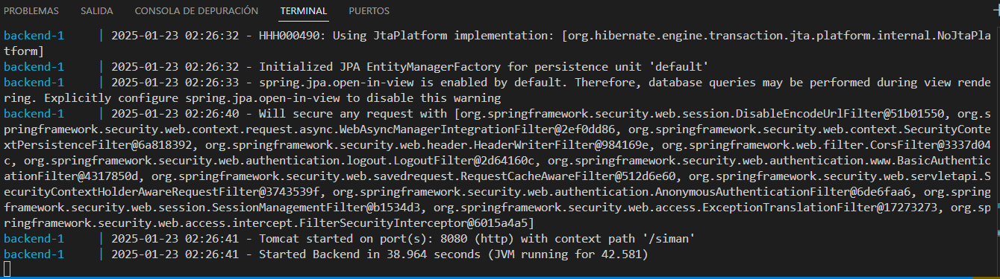
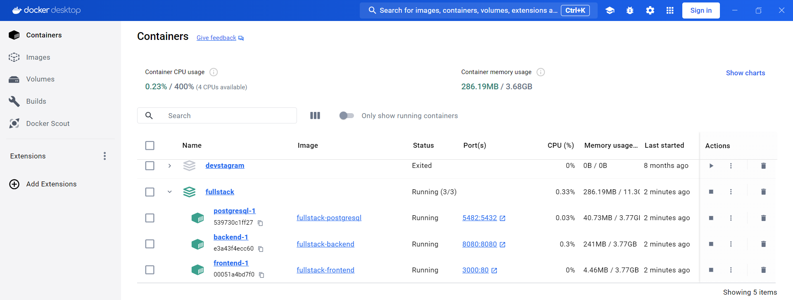
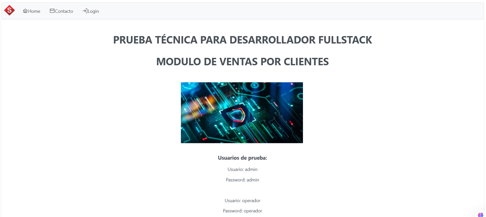
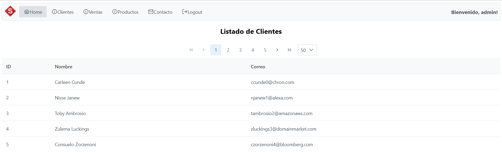
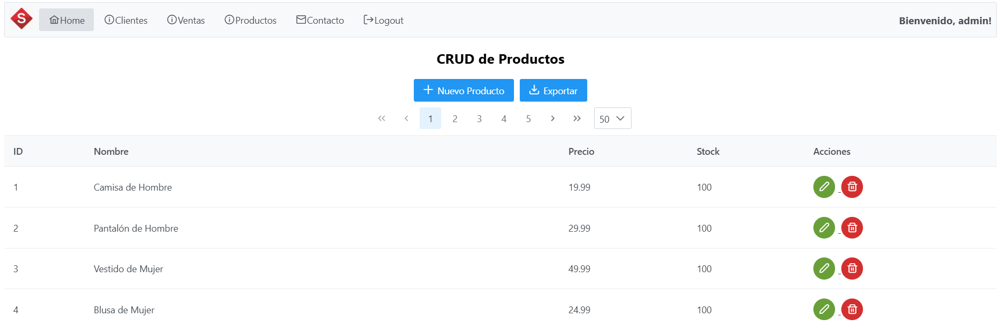
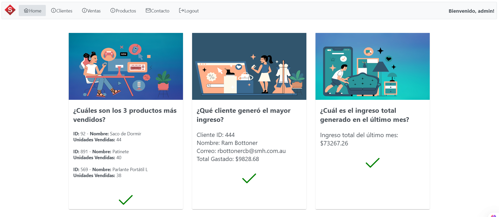

# PRUEBA TÉCNICA MÓDULO DE VENTAS

## Autor: Mario Efraín Moreno Cartagena
## Correo: morenocartagena@outlook.com

## Requerimientos

1. Tener instalado Docker o Docker Desktop. 
2. Tener disponibles los puertos 3000, 5482 y 8080 en el entorno local.
3. Clonar el repositorio.

## Descripción
La carpeta principal del proyecto es Fullstack. El proyecto consta de tres subcarpetas: backend, frontend y PostgreSQL. 
Se incluye un archivo docker-compose.yml en la carpeta principal para levantar el sistema usando contenedores.
El backend está hecho con Spring Boot y Spring Security. El frontend con React, PrimeReact y PrimeFLex.
La base de datos está hecha en PostgreSQL, los datos del contenedor se persisten en la subcarpeta volumen que se
crea dentro de la carpeta PostgreSQL.

## Levantar proyecto
Acceder a la carpeta Fullstack y ejecutar el siguiente comando:
### docker-compose up --build

Para bajar el proyecto:
### docker-compose down

Luego esperar a que se descarguen las imágenes de los contenedores y se copien los archivos:

Se puede ver el estado con Docker Desktop:

## URL de la aplicación
Abrir [http://localhost:3000](http://localhost:3000) en el navegador. En la página de Home se pueden ver los usuario de prueba.
En el Login, el usuario administrador tiene acceso a todos los módulos. El operador solamente al CRUD de Productos.

### Usuario: admin  Password: admin
### Usuario: operador  Password: operador

## Módulos
El sistema consta de tres módulos principales:
Clientes: Lista los clientes
Productos: CRUD deproductos
Ventas: Detalle de ventas

## API
Los endpoints del backend se pueden probar mediante Swagger UI:
[http://localhost:8080/siman/swagger-ui/index.html](http://localhost:8080/siman/swagger-ui/index.html)

## Finalizar proyecto
Para bajar el proyecto:
### docker-compose down
